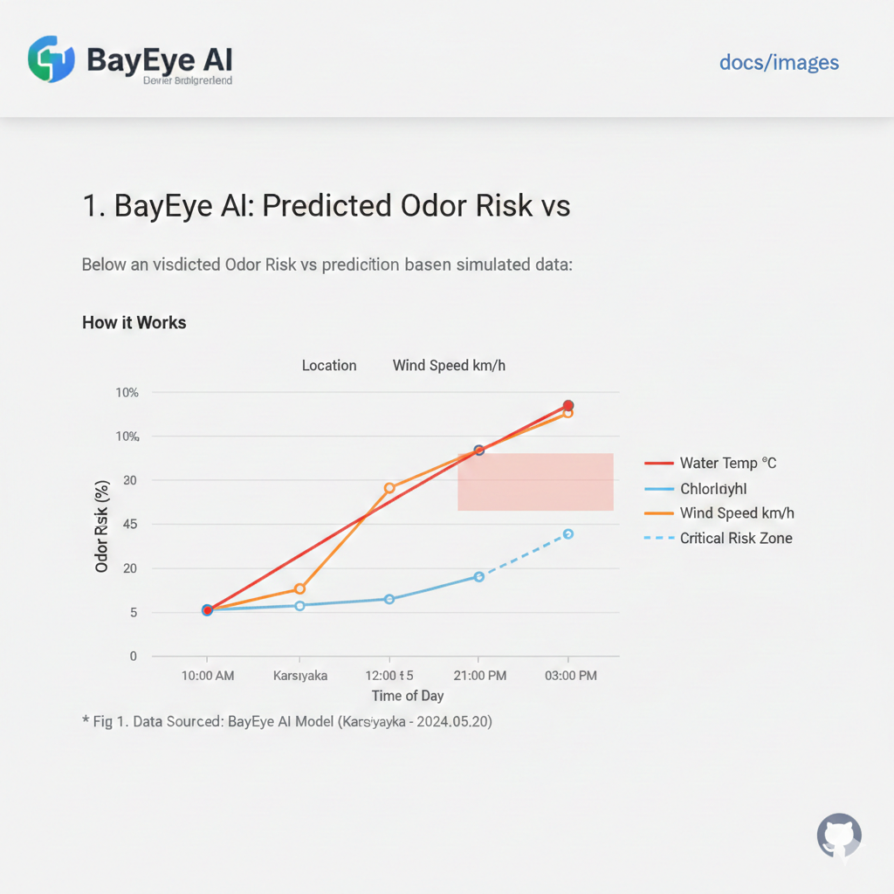

# BayEye AI: Izmir Bay Environmental Monitor

BayEye AI is a predictive system designed to monitor water quality and predict odor levels in Izmir Bay using Data Fusion (Satellite + Weather data).

## Project Structure
- `src/main.py`: The API Gateway.
- `src/engine.py`: The AI/Mathematical model for risk calculation.
- `src/data_fetcher.py`: Simulates real-time data ingestion.

## Methodology

The model analyzes the correlation between **Eutrophication (Algae growth)** and **Thermal Inversion**. When wind speeds drop and water temperature rises, the system alerts the municipality to activate circulation pumps.

